# 中国能源变革与世界能源发展趋势分析

> **研究周期**：2020–2025年（部分前瞻数据延伸至2026–2030年）
>
> **数据截止**：2026年7月
>
> **分析方法**：定量数据整理与可视化 + "资源权-通道权-市场权"三权框架 + "资源-技术-数据"三维框架 + 结构化战略分析框架（利益相关方分析、结构分析、趋势判断）

---

## 目录

- [一、全球能源投资规模与格局](#一全球能源投资规模与格局)
- [二、中国能源变革全景](#二中国能源变革全景)
- [三、能源技术方向与热点赛道](#三能源技术方向与热点赛道)
- [四、能源产业链与各级市场](#四能源产业链与各级市场)
- [五、地缘政治与国内政策](#五地缘政治与国内政策)
- [六、技术经济性分析](#六技术经济性分析)
- [七、风险与挑战](#七风险与挑战)
- [八、AI带来的新变量](#八ai带来的新变量)
- [九、学术理论基础](#九学术理论基础)
- [十、分析框架](#十分析框架)
- [十一、战略推演与预测](#十一战略推演与预测)
- [十二、结论与展望](#十二结论与展望)
- [附录：分析方法说明](#附录分析方法说明)
- [参考文献](#参考文献)

---

## 一、全球能源投资规模与格局

### 1.1 全球能源投资总量：历史性跨越

2024年，全球能源投资总额首次突破3万亿美元大关，其中约2万亿美元流向清洁能源技术与基础设施[1]。清洁能源投资规模已达到化石燃料投资的两倍，而2015年这一比例尚为2:1，到2024年已飙升至10:1[2]。

到2025年，全球能源投资总额进一步增长至3.3万亿美元，其中清洁领域投资约2.2万亿美元，化石燃料投资约1.1万亿美元[3][4]。

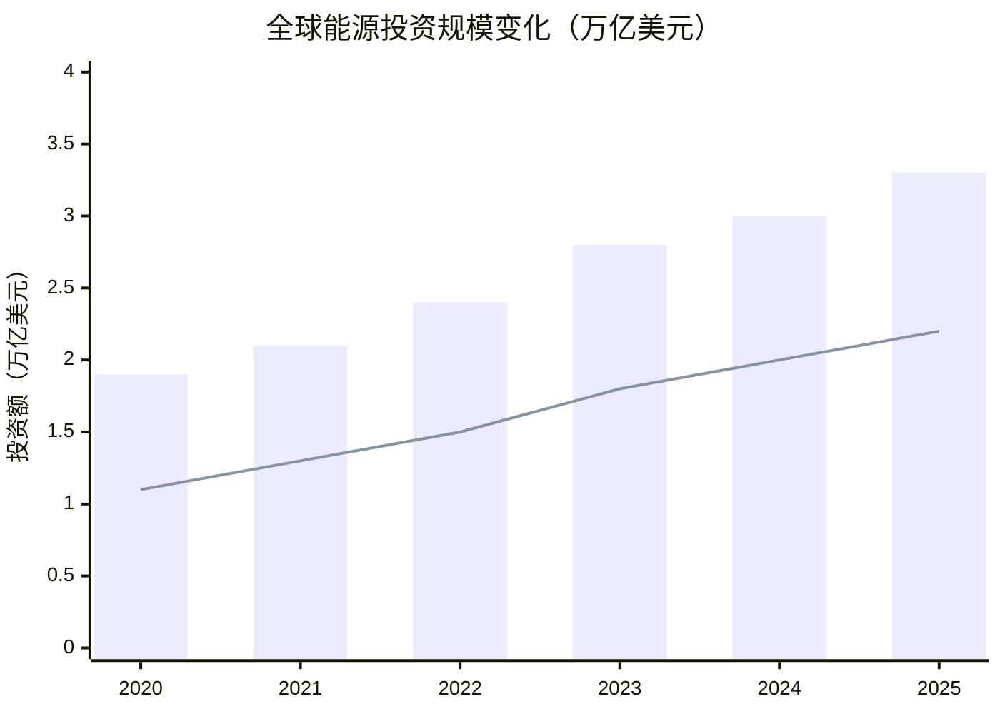
```mermaid
xychart-beta
    title "全球能源投资规模变化（万亿美元）"
    x-axis [2020, 2021, 2022, 2023, 2024, 2025]
    y-axis "投资额（万亿美元）" 0 --> 4
    bar [1.9, 2.1, 2.4, 2.8, 3.0, 3.3]
    line [1.1, 1.3, 1.5, 1.8, 2.0, 2.2]
```

> **注**：柱状图为全球能源总投资，折线图为清洁能源投资。数据来源：IEA历史统计及估计值[1][2][3]。

### 1.2 投资结构：清洁能源主导格局确立

| 投资领域 | 2024年投资额（十亿美元） | 占比 | 核心驱动 |
|---------|----------------------|------|---------|
| 可再生能源发电 | 500+ | ~25% | 太阳能光伏主导 |
| 电网与储能 | 450+ | ~22% | 可再生并网需求 |
| 能效与终端电气化 | 380+ | ~19% | 电动汽车驱动 |
| 核能 | 80 | ~4% | 核电复兴 |
| 低排放燃料 | ~30 | ~1.5% | 氢能、生物燃料 |
| 化石燃料 | 1100 | ~55%（总投资） | 油气上游 |

**太阳能光伏投资在2024年超过5000亿美元，首次超越所有其他发电技术投资之和**[2]。2023年每投入1美元于风电和光伏所获得的发电量，是十年前同等投入的2.5倍[2]。

### 1.3 区域投资分布：中国领先，新兴市场滞后

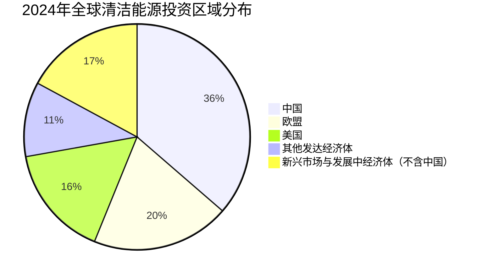
```mermaid
pie title 2024年全球清洁能源投资区域分布
    "中国" : 680
    "欧盟" : 370
    "美国" : 300
    "其他发达经济体" : 200
    "新兴市场与发展中经济体（不含中国）" : 320
```

中国在2024年的清洁能源投资接近6800亿美元，占全球约三分之一[2]。新兴市场与发展中经济体（不含中国）仅占全球清洁能源投资的约15%[2]。

### 1.4 核心组织与主要参与者

| 组织类别 | 代表机构 | 核心职能 |
|---------|---------|---------|
| **国际组织** | IEA、IRENA、世界银行 | 政策协调、标准制定、数据基准 |
| **中国国家机构** | 国家能源局、发改委、工信部 | 规划制定、产业政策 |
| **中国央企** | 国家能源集团、中核集团、中石化、国家电投、三峡集团 | 能源生产、技术研发 |
| **科技企业** | Google、Microsoft、Amazon、Meta、腾讯、阿里巴巴 | 数据中心能源采购 |
| **产业联盟** | 中国氢能联盟（230+成员）、安徽省聚变产业联合会（200+成员） | 标准制定、产业协同 |

---

## 二、中国能源变革全景

### 2.1 可再生能源装机容量：全球绝对领先

截至2024年底，中国发电装机容量呈现以下格局[7][6]：

| 能源类型 | 装机容量（亿千瓦） | 同比增长 | 全球地位 |
|---------|-----------------|---------|---------|
| **总装机容量** | 33.5 | 14.6% | 全球第一 |
| 太阳能发电 | 8.9 | 45.2% | 全球第一（占全球约40%） |
| 风力发电 | 5.2 | 18.0% | 全球第一 |
| 水力发电（含抽蓄） | 4.36 | 3.2% | 全球第一 |

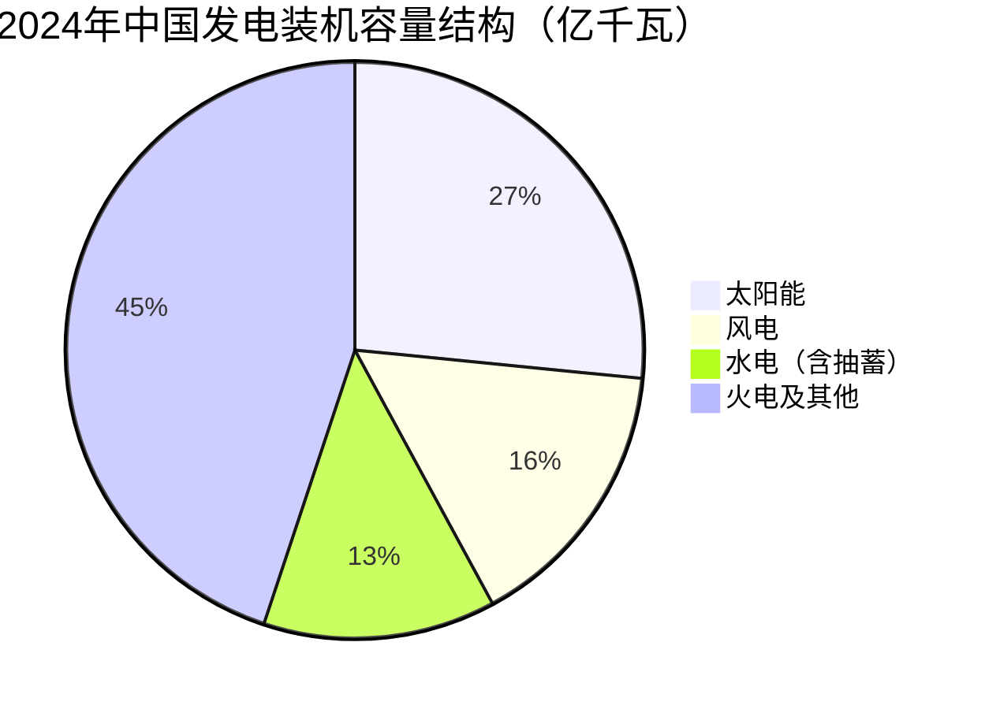
```mermaid
pie title 2024年中国发电装机容量结构（亿千瓦）
    "太阳能" : 8.9
    "风电" : 5.2
    "水电（含抽蓄）" : 4.36
    "火电及其他" : 15.04
```

### 2.2 核聚变：从跟跑到领跑的战略跃迁

2025–2026年，中国可控核聚变领域取得了一系列突破性进展：

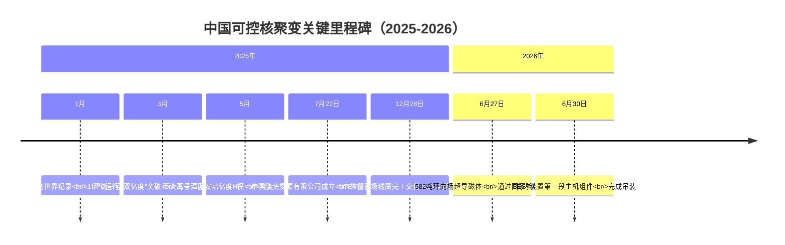
```mermaid
timeline
    title 中国可控核聚变关键里程碑（2025-2026）
    section 2025年
        1月 : EAST创世界纪录<br/>1亿°C运行1066秒
        3月 : 环流三号"双亿度"突破<br/>离子温度1.17亿°C
        5月 : 环流三号百万安培亿度H模<br/>聚变三乘积达10²⁰量级
        7月22日 : 中国聚变能源有限公司成立<br/>注册资本150亿元
        12月28日 : ITER校正场线圈完工交付<br/>全部18个线圈
    section 2026年
        6月27日 : 582吨环向场超导磁体<br/>通过国家验收/全球最大
        6月30日 : BEST装置第一段主机组件<br/>完成吊装
```

**关键数据**：

- **EAST"亿度千秒"纪录**（2025年1月）：1亿摄氏度等离子体稳态运行1066秒[9]
- **环流三号"双亿度"**（2025年3月）：原子核温度1.17亿°C、电子温度1.6亿°C[16]
- **中国聚变能源有限公司**（2025年7月）：注册资本150亿元，7家央国企联合增资114.92亿元[10][11]
- **582吨超导磁体**（2026年6月）：全球最大，超导材料成本从400元/米降至100元/米[12]
- **专利领先**：中国核聚变技术专利申请量已超越美国，跃升为全球第一[15]
- **民营融资爆发**：2025年上半年民营聚变融资超115亿元，2019年前几乎为零[14]

**发展时间表**：

| 节点 | 时间 | 目标 |
|------|------|------|
| BEST紧凑型聚变能实验装置建成 | 2027年底 | 全面建成 |
| 首次聚变发电演示 | 2030年前后 | 产出中国第一度聚变清洁电能 |
| CFETR聚变工程实验堆建成 | 2035年 | 200 MW聚变功率 |
| 大规模商业化 | 2050年 | 产业化推广 |

### 2.3 氢能源：从航天到民用的战略迁移

中国是全球最大氢气生产国，2023年产量约3300万吨[26]。2024年《能源法》首次将氢能纳入能源管理体系[24]。

| 维度 | 数据 |
|------|------|
| 中国绿氢承诺投资 | 330亿美元（全球第一）[25] |
| 电解槽出货量全球占比 | 60%[24] |
| 加氢站建设规模 | 全球第一[24] |
| 累计规划绿氢项目 | 超400个，产能突破800万吨/年[24] |

**氢能与航天/军事的战略耦合**：液氢作为火箭高能推进剂已有60多年历史。中国航天科技集团六院主导液氢技术民用化：2024年发布国产首套5吨/天氢液化系统，目标研制30吨/天级装置[28]。氢燃料电池在军事领域具有高能量转换效率、低噪音（隐身特性）等独特优势[28]。

### 2.4 "新三样"出口与产业链

电动汽车、光伏产品、锂电池已成为中国外贸出口的"新三样"[39]，出口同比分别增长131.8%、67.8%、86.7%。

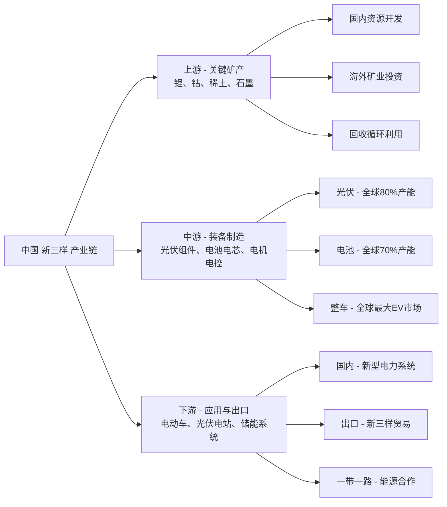
```mermaid
flowchart LR
    A["中国 新三样 产业链"] --> B["上游 - 关键矿产<br/>锂、钴、稀土、石墨"]
    A --> C["中游 - 装备制造<br/>光伏组件、电池电芯、电机电控"]
    A --> D["下游 - 应用与出口<br/>电动车、光伏电站、储能系统"]

    B --> B1["国内资源开发"]
    B --> B2["海外矿业投资"]
    B --> B3["回收循环利用"]

    C --> C1["光伏 - 全球80%产能"]
    C --> C2["电池 - 全球70%产能"]
    C --> C3["整车 - 全球最大EV市场"]

    D --> D1["国内 - 新型电力系统"]
    D --> D2["出口 - 新三样贸易"]
    D --> D3["一带一路 - 能源合作"]
```

---

## 三、能源技术方向与热点赛道

### 3.1 核聚变技术

| 技术路线 | 代表机构/企业 | 核心优势 | 主要挑战 |
|---------|-------------|---------|---------|
| 全超导托卡马克 | 中科院（EAST/BEST/CFETR）、ITER | 技术成熟度最高 | 工程规模庞大 |
| 球形托卡马克 | 星环聚能 | 体积小、成本低 | 物理验证不足 |
| 场反位形 | 瀚海聚能 | 结构简单 | 等离子体稳定性 |
| 氢硼聚变 | 新奥科技 | 燃料丰富、无中子 | 点火温度极高 |

### 3.2 钙钛矿太阳能电池

2025年，中国在单结钙钛矿太阳能电池领域取得重大突破——0.1平方厘米认证稳态效率达27.3%，1平方厘米达26.9%，双双刷新世界纪录[36]。

### 3.3 钠离子电池与固态电池

2026年，钠离子电池与固态电池迎来发展窗口期[38]。钠离子电池储能产业正在提速——材料降本、订单落地、应用扩围同步推进[37]。

### 3.4 储能技术

全球电池储能投资2024年超过500亿美元[2]，但投资高度集中——2023年发达经济体和中国每投入1美元于电池储能，其他新兴市场仅投入1美分[2]。

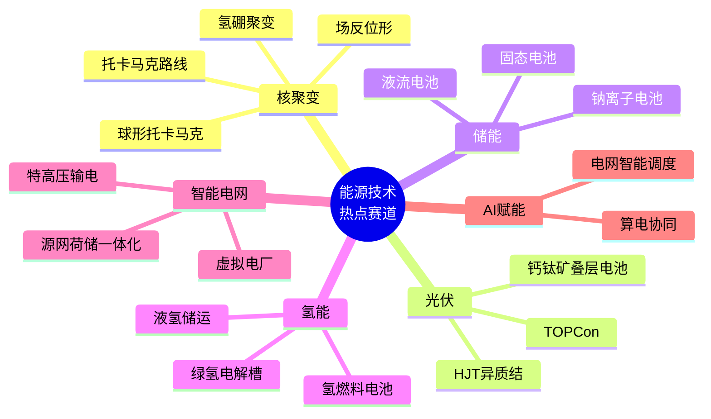
```mermaid
mindmap
  root((能源技术<br/>热点赛道))
    核聚变
      托卡马克路线
      球形托卡马克
      场反位形
      氢硼聚变
    光伏
      钙钛矿叠层电池
      HJT异质结
      TOPCon
    储能
      钠离子电池
      固态电池
      液流电池
    氢能
      绿氢电解槽
      液氢储运
      氢燃料电池
    智能电网
      源网荷储一体化
      虚拟电厂
      特高压输电
    AI赋能
      电网智能调度
      算电协同
```

---

## 四、能源产业链与各级市场

### 4.1 上游：关键矿产——能源转型的"新石油"

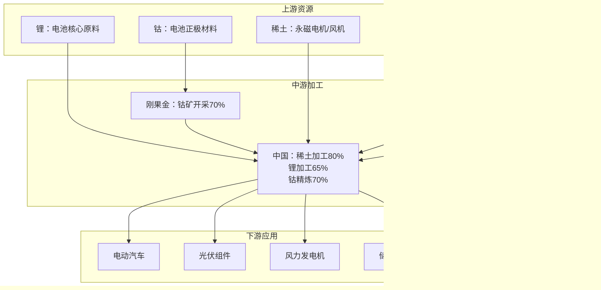
```mermaid
flowchart TB
    subgraph 上游资源
        A1["锂：电池核心原料"]
        A2["钴：电池正极材料"]
        A3["稀土：永磁电机/风机"]
        A4["石墨：电池负极"]
        A5["铜：电网/电机"]
    end

    subgraph 中游加工
        B1["中国：稀土加工80%<br/>锂加工65%<br/>钴精炼70%"]
        B2["刚果金：钴矿开采70%"]
        B3["澳大利亚：锂矿开采50%"]
    end

    subgraph 下游应用
        C1["电动汽车"]
        C2["光伏组件"]
        C3["风力发电机"]
        C4["储能系统"]
    end

    A1 --> B1
    A2 --> B2 --> B1
    A3 --> B1
    A4 --> B1
    A5 --> B1
    B1 --> C1
    B1 --> C2
    B1 --> C3
    B1 --> C4
```

**美国关键矿产困境**：美国12种关键矿产完全依赖进口，29种进口依赖度超50%[29]。美国从MSP（矿产安全伙伴关系）到FORGE机制（54国参与），构建关键矿产全球联盟[30]。

### 4.2 中游：装备制造

| 装备类别 | 中国全球份额 | 核心企业 |
|---------|------------|---------|
| 光伏组件 | ~80% | 隆基、晶科、天合、通威 |
| 锂电池 | ~70% | 宁德时代、比亚迪 |
| 电动汽车 | ~60%（产量） | 比亚迪、蔚来、小鹏、理想 |
| 电解槽 | ~60% | 隆基氢能、考克利尔竞立 |

### 4.3 下游：应用领域与增长机会

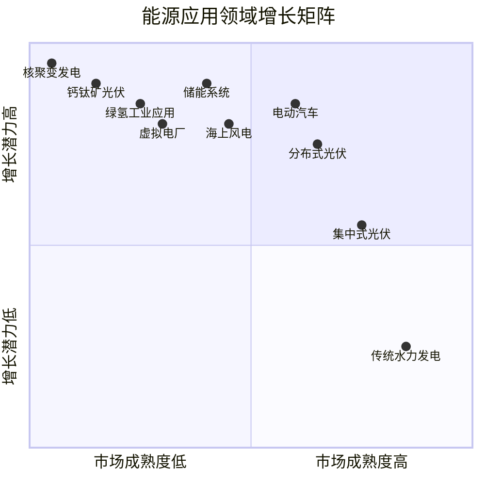
```mermaid
quadrantChart
    title 能源应用领域增长矩阵
    x-axis "市场成熟度低" --> "市场成熟度高"
    y-axis "增长潜力低" --> "增长潜力高"
    "传统水力发电": [0.85, 0.25]
    "集中式光伏": [0.75, 0.55]
    "分布式光伏": [0.65, 0.75]
    "海上风电": [0.45, 0.80]
    "电动汽车": [0.60, 0.85]
    "储能系统": [0.40, 0.90]
    "绿氢工业应用": [0.25, 0.85]
    "核聚变发电": [0.05, 0.95]
    "虚拟电厂": [0.30, 0.80]
    "钙钛矿光伏": [0.15, 0.90]
```

---

## 五、地缘政治与国内政策

### 5.1 中国能源进口依赖与安全挑战

| 能源类型 | 对外依存度（2024年） | 核心风险 |
|---------|-------------------|---------|
| 石油 | ~72% | 90%海运（马六甲海峡） |
| 天然气 | ~43% | 供应多元化不足 |
| 铀 | ~70%+ | 核燃料供应链 |

### 5.2 能源通道格局

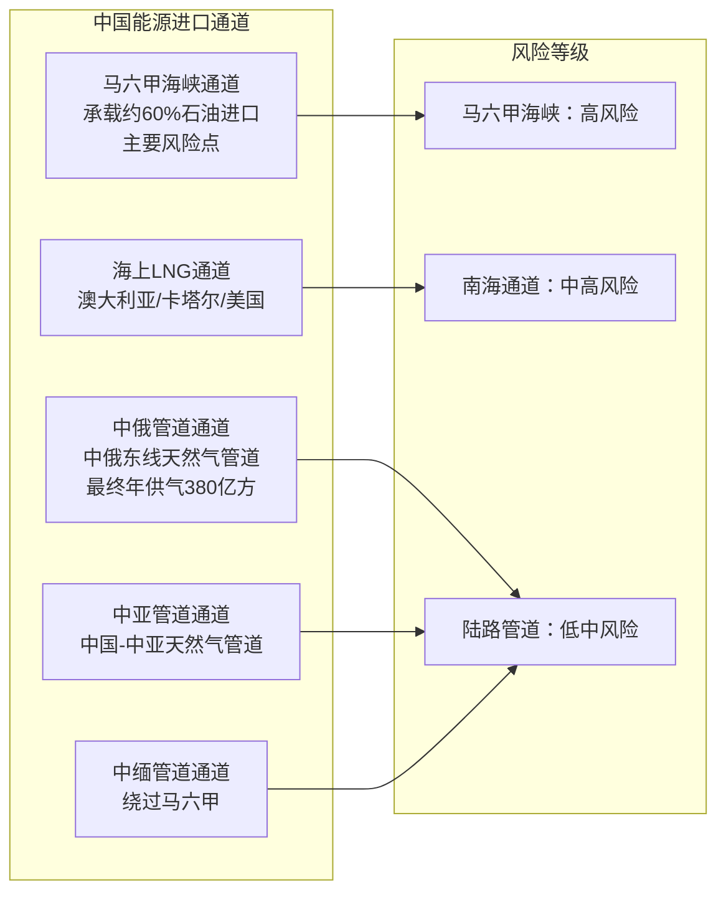
```mermaid
flowchart LR
    subgraph 中国能源进口通道
        direction TB
        C1["马六甲海峡通道<br/>承载约60%石油进口<br/>主要风险点"]
        C2["中俄管道通道<br/>中俄东线天然气管道<br/>最终年供气380亿方"]
        C3["中亚管道通道<br/>中国-中亚天然气管道"]
        C4["中缅管道通道<br/>绕过马六甲"]
        C5["海上LNG通道<br/>澳大利亚/卡塔尔/美国"]
    end

    subgraph 风险等级
        R1["马六甲海峡：高风险"]
        R2["南海通道：中高风险"]
        R3["陆路管道：低中风险"]
    end

    C1 --> R1
    C2 --> R3
    C3 --> R3
    C4 --> R3
    C5 --> R2
```

### 5.3 国际竞争力比较

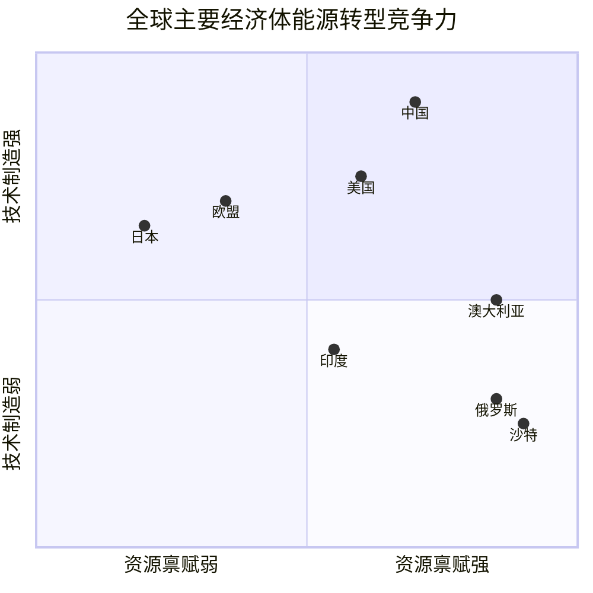
```mermaid
quadrantChart
    title 全球主要经济体能源转型竞争力
    x-axis "资源禀赋弱" --> "资源禀赋强"
    y-axis "技术制造弱" --> "技术制造强"
    "中国": [0.70, 0.90]
    "美国": [0.60, 0.75]
    "欧盟": [0.35, 0.70]
    "日本": [0.20, 0.65]
    "印度": [0.55, 0.40]
    "俄罗斯": [0.85, 0.30]
    "沙特": [0.90, 0.25]
    "澳大利亚": [0.85, 0.50]
```

### 5.4 关键矿产博弈

| 维度 | 中国 | 美国 | 欧盟 |
|------|------|------|------|
| 稀土加工 | 全球80% | 进口依赖 | 进口依赖 |
| 锂加工 | 全球65% | 加速布局 | 依赖进口 |
| 钴精炼 | 全球70% | 进口依赖 | 依赖进口 |
| 战略应对 | 出口管制 | FORGE联盟(54国) | 《关键原材料法案》 |

---

## 六、技术经济性分析

### 6.1 光伏发电成本

组件成本在过去两年下降30%[2]。2023年每投入1美元于风电和光伏所获得的发电量，是十年前同等投入的2.5倍[2]。但光伏发电高峰期批发电价偶尔降至零以下[2]，凸显了储能投资的必要性。

### 6.2 氢能成本

| 制氢路线 | 当前成本（元/公斤） | 2030年预测 | 经济性临界点 |
|---------|-------------------|-----------|------------|
| 煤制氢 | 9–12 | 稳定 | 已具竞争力 |
| 绿氢（含补贴） | 30–40 | 降至25以下 | 2035年前后 |
| 绿氢（电价0.15–0.2元/kWh） | 9.5–10 | 进一步下降 | 接近煤制氢 |

### 6.3 核聚变经济性

核聚变处于"重投入、零产出"阶段。超导材料成本从400元/米降至100元/米[12]，工程降本正在加速。经济性拐点预计出现在2040年示范电站并网之后。

---

## 七、风险与挑战

### 7.1 能源三难困境

世界能源理事会的"能源三难困境"框架指出，能源系统面临三个相互竞争的目标：**能源安全、能源公平（可负担性）、环境可持续性**[35]。中国在能源转型中面临典型的三难困境——需要在三个目标之间走钢丝[34]。

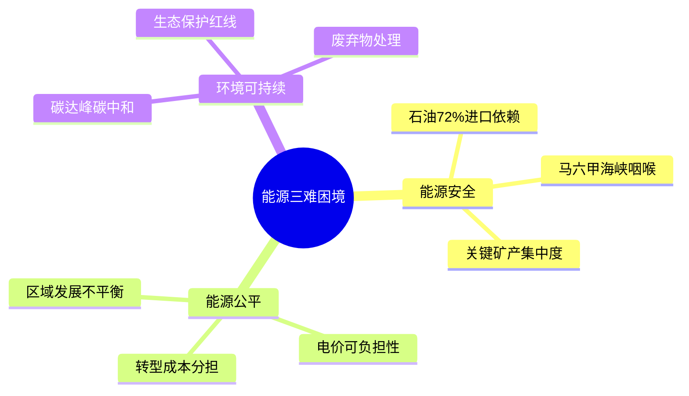
```mermaid
mindmap
  root((能源三难困境))
    能源安全
      石油72%进口依赖
      马六甲海峡咽喉
      关键矿产集中度
    能源公平
      转型成本分担
      电价可负担性
      区域发展不平衡
    环境可持续
      碳达峰碳中和
      生态保护红线
      废弃物处理
```

### 7.2 主要风险

- **供应链风险**：光伏产能过剩、关键矿产集中度、电网瓶颈
- **地缘政治风险**：贸易壁垒（美国关税/欧盟反补贴）、技术脱钩、能源武器化
- **技术风险**：核聚变商业化不确定性、氢能需求信号不明[25]
- **系统性风险**：电力系统灵活性不足、转型碎片化[4]

---

## 八、AI带来的新变量

### 8.1 数据中心能耗爆发

| 指标 | 数值 |
|------|------|
| 全球数据中心用电量（2022年） | 460 TWh（占全球总能耗近2%）[19] |
| 2026年预测 | 620–1050 TWh（可能翻倍）[19] |
| GPT-4训练耗电 | 3820万度/95天[20] |
| ChatGPT搜索vs谷歌搜索能耗 | 约10倍[21] |
| 中国数据中心用电预测（2030年） | 最高7000亿千瓦时（占5.3%）[22] |

### 8.2 核能复兴：科技巨头的"核电竞赛"

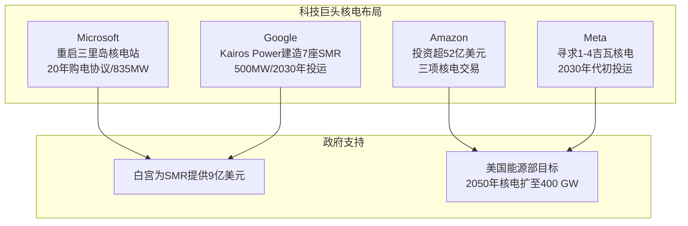
```mermaid
flowchart TB
    subgraph 科技巨头核电布局
        MS["Microsoft<br/>重启三里岛核电站<br/>20年购电协议/835MW"]
        GG["Google<br/>Kairos Power建造7座SMR<br/>500MW/2030年投运"]
        AM["Amazon<br/>投资超52亿美元<br/>三项核电交易"]
        MT["Meta<br/>寻求1-4吉瓦核电<br/>2030年代初投运"]
    end

    subgraph 政府支持
        WH["白宫为SMR提供9亿美元"]
        DOE["美国能源部目标<br/>2050年核电扩至400 GW"]
    end

    MS --> WH
    GG --> WH
    AM --> DOE
    MT --> DOE
```

### 8.3 "东数西算"与绿电协同

中国"东数西算"工程规划8个国家算力枢纽节点，要求新建数据中心绿电占比不低于80%[22]。"十五五"期间算力年均新增电力需求约600–1000亿千瓦时[22]。

### 8.4 AI变量的辩证分析

AI对能源系统的影响是双面的——需求侧是电力需求的巨大增量来源，供给侧是能源系统优化的赋能工具。关键在于AI的能源需求增量能否与清洁能源供给增量实现时空匹配。

---

## 九、学术理论基础

### 9.1 能源三难困境理论

世界能源理事会提出的"能源三难困境指数"覆盖三个维度：能源安全、能源公平、环境可持续性[35]。2024年版报告指出，俄乌冲突引发的需求驱动型能源冲击使全球能源系统发生了深刻变化[35]。

### 9.2 能源转型理论

核心概念包括：路径依赖（现有基础设施的沉没成本）、锁入效应（化石设施30-50年寿命）、创造性破坏（新能源对传统能源体系的替代）。

### 9.3 资源诅咒与能源地缘政治

在能源转型背景下：传统能源出口国面临"stranded assets"风险；关键矿产资源国面临新一轮"资源诅咒"风险；技术制造国在能源转型中获得更大的价值链份额。

---

## 十、分析框架

### 10.1 "资源权-通道权-市场权"三权框架

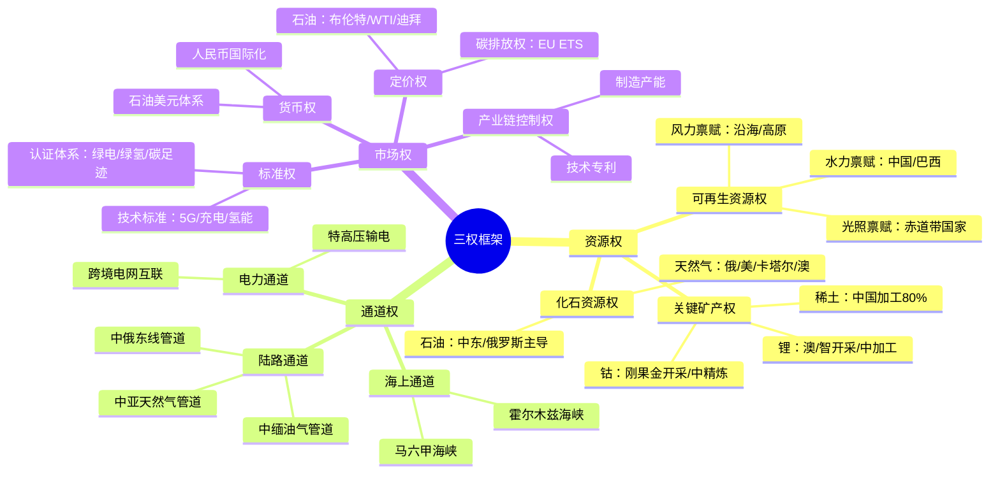
```mermaid
mindmap
  root((三权框架))
    资源权
      化石资源权
        石油：中东/俄罗斯主导
        天然气：俄/美/卡塔尔/澳
      可再生资源权
        光照禀赋：赤道带国家
        风力禀赋：沿海/高原
        水力禀赋：中国/巴西
      关键矿产权
        稀土：中国加工80%
        锂：澳/智开采/中加工
        钴：刚果金开采/中精炼
    通道权
      海上通道
        马六甲海峡
        霍尔木兹海峡
      陆路通道
        中俄东线管道
        中亚天然气管道
        中缅油气管道
      电力通道
        特高压输电
        跨境电网互联
    市场权
      定价权
        石油：布伦特/WTI/迪拜
        碳排放权：EU ETS
      标准权
        技术标准：5G/充电/氢能
        认证体系：绿电/绿氢/碳足迹
      货币权
        石油美元体系
        人民币国际化
      产业链控制权
        制造产能
        技术专利
```

**框架应用**：在传统化石能源时代，资源权和通道权是核心。但在能源转型时代，市场权（特别是标准权和产业链控制权）的战略价值急剧上升。中国的情况：资源权方面油气弱但可再生/矿产加工强；通道权方面海上弱但陆路/电力通道强；市场权方面制造产能强但货币权弱[30][32][33]。

### 10.2 "资源-技术-数据"三维框架

| 维度 | 内涵 | 传统时代权重 | 转型时代权重 | 中国位置 |
|------|------|-----------|-----------|---------|
| **资源** | 自然禀赋 | 60% | 35% | 中等偏上 |
| **技术** | 研发/制造/工程能力 | 30% | 45% | 领先 |
| **数据** | 能源系统数据/算力/AI | 10% | 20% | 快速崛起 |

**数据维度**是转型时代的新增变量。能源系统正在从"物理-化学"系统向"物理-化学-数字"系统演进——智能电网、虚拟电厂、碳数据追踪、AI预测等使数据成为新的权力维度。

---

## 十一、战略推演与预测

> **方法论说明**：本节运用结构化战略分析框架，从利益相关方动力分析、结构与环境分析、趋势与时机判断三个维度，结合实际企业清单与利益关系网络，对全球能源格局进行多层级推演。

### 11.1 利益相关方动力分析

#### 11.1.1 中国：安全底线、价值追求与发展诉求的三重驱动

**安全底线（行为底线）**：中国石油对外依存度72%，90%经海运，马六甲海峡构成生存性威胁[32][33]。这一恐惧定义了中国能源安全的底线——必须降低化石能源进口依赖。一个72%依赖石油进口的大国，其能源转型的底层动力不是环保理想，而是生存安全。

**价值追求（理想标准）**："双碳"目标（2030碳达峰/2060碳中和）和"人类命运共同体"理念构成价值追求。但当转型与生存安全冲突时，生存优先——2023年中国超过50 GW煤电获批[2]即为明证。

**发展诉求（行为变数）**："新三样"出口的高增长（电动汽车+131.8%、光伏+67.8%、锂电池+86.7%）[39]构成了发展诉求——能源转型不仅是安全战略，更是产业竞争力和经济增量的来源。

**立场定位**：中国作为最大的发展中国家和能源消费国，其立场是"发展型安全国家"——既不能放弃发展权，也不能牺牲安全性。路径选择是"先立后破"——在新能源体系完全建立之前，化石能源作为安全垫不可轻易撤除。

#### 11.1.2 美国：霸权维护下的竞争逻辑

**安全底线**：美国12种关键矿产完全依赖进口[29]，这是其在能源转型时代的"新马六甲困境"。

**立场定位**：美国作为守成霸权国，核心目标不是自身能源转型速度，而是阻止中国在能源转型中获得压倒性优势。政策两面性：一方面推进自身清洁能源（IRA），另一方面遏制中国清洁能源产业（关税/技术限制）。

#### 11.1.3 欧盟：价值驱动的理想主义困境

**安全底线**：俄乌冲突后，欧盟对俄罗斯天然气依赖骤降。REPowerEU计划目标2030年内部生产1000万吨可再生氢——但BNEF预计仅能实现1/8[25]。

**立场定位**：欧盟作为"规范性力量"，以气候理想驱动转型，但现实约束不断迫使理想让步，呈现"高调-低效"特征。

#### 11.1.4 其他关键方

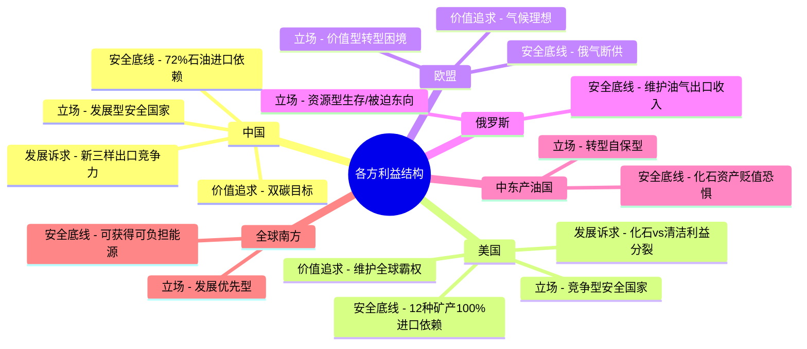
```mermaid
mindmap
  root((各方利益结构))
    中国
      安全底线 - 72%石油进口依赖
      价值追求 - 双碳目标
      发展诉求 - 新三样出口竞争力
      立场 - 发展型安全国家
    美国
      安全底线 - 12种矿产100%进口依赖
      价值追求 - 维护全球霸权
      发展诉求 - 化石vs清洁利益分裂
      立场 - 竞争型安全国家
    欧盟
      安全底线 - 俄气断供
      价值追求 - 气候理想
      立场 - 价值型转型困境
    俄罗斯
      安全底线 - 维护油气出口收入
      立场 - 资源型生存/被迫东向
    中东产油国
      安全底线 - 化石资产贬值恐惧
      立场 - 转型自保型
    全球南方
      安全底线 - 可获得可负担能源
      立场 - 发展优先型
```

### 11.2 结构与环境分析

#### 11.2.1 版图：资源分布与通道格局

中国面临"东弱西强"的格局——东部沿海是经济和能源消费中心，但化石能源通道脆弱；西部和北部是可再生能源和关键矿产富集区，但远离负荷中心。特高压输电和"东数西算"本质上是用电物技术重塑版图格局。

#### 11.2.2 制度：治理模式比较

| 维度 | 中国 | 美国 | 欧盟 |
|------|------|------|------|
| 治理模式 | 国家主导+市场补充 | 市场主导+政策干预 | 超国家协调 |
| 产业政策 | 强势规划（五年规划） | 防御性（IRA/CHIPS） | Green Deal |
| 碳定价 | 全国碳市场（2021年） | IRA税收抵免替代 | EU ETS（全球最大） |

#### 11.2.3 技术变革

| 技术变革 | 对资源版图的影响 | 对制度的影响 |
|---------|---------------|-----------|
| 光伏成本下降30% | 中东石油贬值压力 | 补贴退坡、市场化竞价 |
| 核聚变突破 | 化石燃料终极替代前景 | 国际聚变合作/竞争新格局 |
| 储能成本下降 | 电网运行模式变革 | 电力市场规则重构 |
| AI算力爆发 | 数据中心成为新负荷中心 | 算力-电力协同治理 |

### 11.3 趋势与时机判断

#### 11.3.1 大势方向

1. **电气化不可逆转**：到2050年全球用电量可能增长75%[21]
2. **清洁能源成本持续下降**：成本下降驱动的市场渗透不是政策可以逆转的
3. **能源系统数字化**：从智能电网到虚拟电厂，全面数字化
4. **产业链区域化与碎片化**：IEA指出转型呈碎片化趋势[4]

#### 11.3.2 时机判断：力量积蓄与突破点

**力量积蓄领域**：
1. AI算力需求积蓄：460→1050 TWh，清洁电力缺口[19]
2. 氢能项目积蓄：800万吨规划产能，需求信号不明[24]
3. 核聚变投入积蓄：265亿+融资，商业化遥远[10][14]
4. 矿产加工能力积蓄：中国80%稀土加工，供应链重构压力

**突破点**：
1. 钙钛矿商业化：效率突破27.3%[36]
2. 绿氢成本临界点：9.5元/kg接近煤制氢[24]
3. 核聚变工程验证：BEST 2027年建成/2030年发电[9]
4. AI-能源协同：核电竞赛+东数西算[21][22]

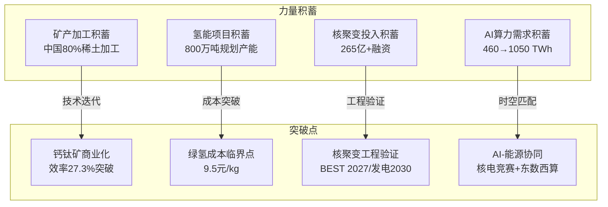
```mermaid
flowchart TB
    subgraph 力量积蓄
        P1["AI算力需求积蓄<br/>460→1050 TWh"]
        P2["氢能项目积蓄<br/>800万吨规划产能"]
        P3["核聚变投入积蓄<br/>265亿+融资"]
        P4["矿产加工积蓄<br/>中国80%稀土加工"]
    end

    subgraph 突破点
        B1["钙钛矿商业化<br/>效率27.3%突破"]
        B2["绿氢成本临界点<br/>9.5元/kg"]
        B3["核聚变工程验证<br/>BEST 2027/发电2030"]
        B4["AI-能源协同<br/>核电竞赛+东数西算"]
    end

    P1 -->|时空匹配| B4
    P2 -->|成本突破| B2
    P3 -->|工程验证| B3
    P4 -->|技术迭代| B1
```

**时机判断**：2027–2030年将是多个技术路线同时进入验证或临界状态的高密度时间窗口。

#### 11.3.3 各方核心利益锚点

| 各方 | 不可退让的核心利益 |
|------|-----------------|
| **中国** | 能源自主可控、产业链主导权、关键矿产加工垄断 |
| **美国** | 技术霸权、美元-能源体系、盟友体系 |
| **欧盟** | 能源独立、气候领导力、绿色标准制定权 |
| **俄罗斯** | 油气出口收入、对华能源议价权 |
| **全球南方** | 发展权、可负担能源获取 |

### 11.4 利益相关方利益网络分析

#### 11.4.1 中国立场的利益辐射网

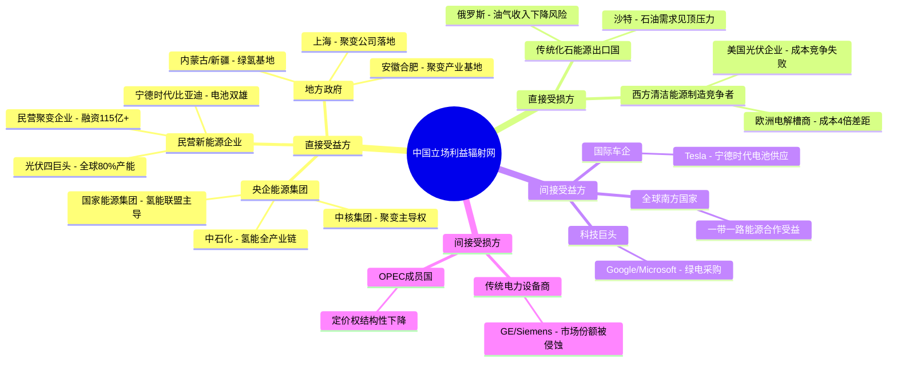
```mermaid
mindmap
  root(("中国立场利益辐射网"))
    直接受益方
      央企能源集团
        中核集团 - 聚变主导权
        中石化 - 氢能全产业链
        国家能源集团 - 氢能联盟主导
      民营新能源企业
        光伏四巨头 - 全球80%产能
        宁德时代/比亚迪 - 电池双雄
        民营聚变企业 - 融资115亿+
      地方政府
        安徽合肥 - 聚变产业基地
        上海 - 聚变公司落地
        内蒙古/新疆 - 绿氢基地
    直接受损方
      传统化石能源出口国
        沙特 - 石油需求见顶压力
        俄罗斯 - 油气收入下降风险
      西方清洁能源制造竞争者
        美国光伏企业 - 成本竞争失败
        欧洲电解槽商 - 成本4倍差距
    间接受益方
      全球南方国家
        一带一路能源合作受益
      国际车企
        Tesla - 宁德时代电池供应
      科技巨头
        Google/Microsoft - 绿电采购
    间接受损方
      OPEC成员国
        定价权结构性下降
      传统电力设备商
        GE/Siemens - 市场份额被侵蚀
```

#### 11.4.2 企业关系网络：核聚变产业链

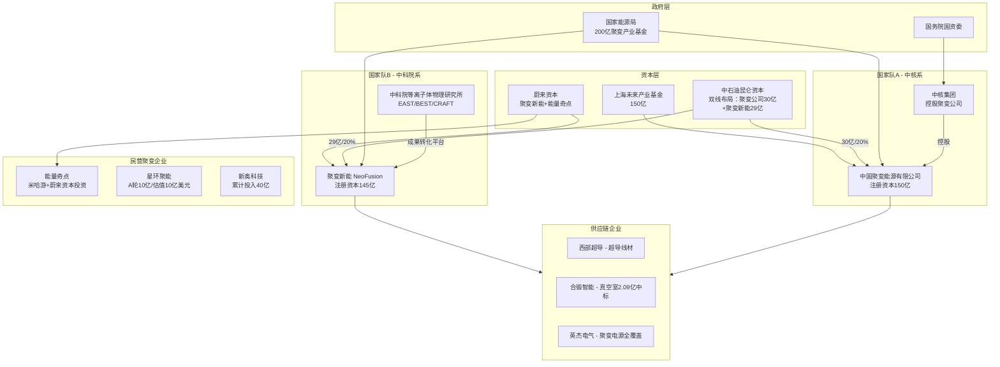
```mermaid
flowchart TB
    subgraph GOV["政府层"]
        G1["国务院国资委"]
        G2["国家能源局<br/>200亿聚变产业基金"]
    end

    subgraph NATLAB["国家队A - 中核系"]
        N1["中核集团<br/>控股聚变公司"]
        N3["中国聚变能源有限公司<br/>注册资本150亿"]
        N1 -->|"控股"| N3
    end

    subgraph CASLAB["国家队B - 中科院系"]
        C1["中科院等离子体物理研究所<br/>EAST/BEST/CRAFT"]
        C2["聚变新能 NeoFusion<br/>注册资本145亿"]
        C1 -->|"成果转化平台"| C2
    end

    subgraph CAPITAL["资本层"]
        P1["中石油昆仑资本<br/>双线布局：聚变公司30亿+聚变新能29亿"]
        P2["上海未来产业基金<br/>150亿"]
        P4["蔚来资本<br/>聚变新能+能量奇点"]
    end

    subgraph PRIVATE["民营聚变企业"]
        PR1["能量奇点<br/>米哈游+蔚来资本投资"]
        PR2["星环聚能<br/>A轮10亿/估值10亿美元"]
        PR4["新奥科技<br/>累计投入40亿"]
    end

    subgraph SUPPLY["供应链企业"]
        S1["西部超导 - 超导线材"]
        S2["合锻智能 - 真空室2.09亿中标"]
        S4["英杰电气 - 聚变电源全覆盖"]
    end

    G1 --> N1
    G2 --> N3
    G2 --> C2

    P1 -->|"30亿/20%"| N3
    P1 -->|"29亿/20%"| C2
    P2 --> N3
    P4 --> C2
    P4 --> PR1

    N3 --> SUPPLY
    C2 --> SUPPLY
```

**关键发现**：中石油昆仑资本是唯一同时连接两大"国家队"的资本节点，形成"双线布局"对冲策略。蔚来资本横跨聚变（聚变新能+能量奇点）和氢能（枡水科技），是跨领域投资枢纽。

#### 11.4.3 企业关系网络：氢能产业链

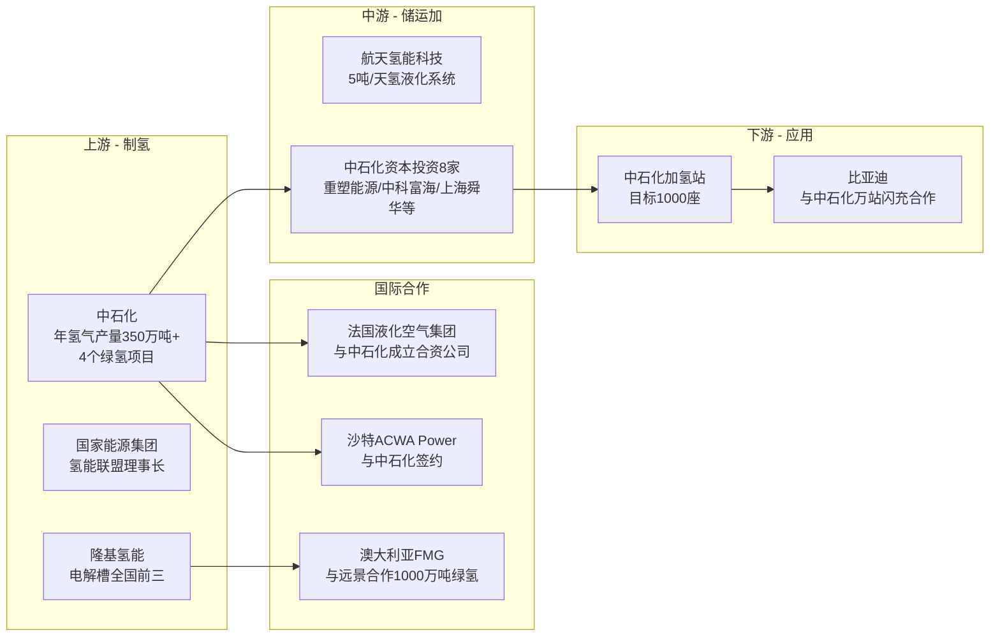
```mermaid
flowchart LR
    subgraph UPSTREAM["上游 - 制氢"]
        U1["中石化<br/>年氢气产量350万吨+<br/>4个绿氢项目"]
        U2["国家能源集团<br/>氢能联盟理事长"]
        U4["隆基氢能<br/>电解槽全国前三"]
    end

    subgraph MIDSTREAM["中游 - 储运加"]
        M1["航天氢能科技<br/>5吨/天氢液化系统"]
        M2["中石化资本投资8家<br/>重塑能源/中科富海/上海舜华等"]
    end

    subgraph DOWNSTREAM["下游 - 应用"]
        D1["中石化加氢站<br/>目标1000座"]
        D2["比亚迪<br/>与中石化万站闪充合作"]
    end

    subgraph INTL_H2["国际合作"]
        I1["法国液化空气集团<br/>与中石化成立合资公司"]
        I2["沙特ACWA Power<br/>与中石化签约"]
        I3["澳大利亚FMG<br/>与远景合作1000万吨绿氢"]
    end

    U1 --> M2
    M2 --> D1
    D1 --> D2
    U1 --> I1
    U1 --> I2
    U4 --> I3
```

#### 11.4.4 "新三样"企业网络与中美资本交叉

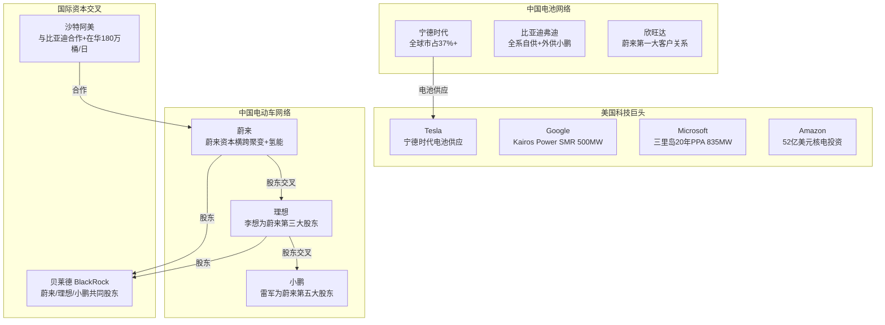
```mermaid
flowchart TB
    subgraph CHINA_BAT["中国电池网络"]
        BAT1["宁德时代<br/>全球市占37%+"]
        BAT2["比亚迪弗迪<br/>全系自供+外供小鹏"]
        BAT3["欣旺达<br/>蔚来第一大客户关系"]
    end

    subgraph CHINA_EV["中国电动车网络"]
        EV1["蔚来<br/>蔚来资本横跨聚变+氢能"]
        EV2["理想<br/>李想为蔚来第三大股东"]
        EV3["小鹏<br/>雷军为蔚来第五大股东"]
        EV1 -->|"股东交叉"| EV2
        EV2 -->|"股东交叉"| EV3
    end

    subgraph US_TECH["美国科技巨头"]
        US1["Tesla<br/>宁德时代电池供应"]
        US3["Google<br/>Kairos Power SMR 500MW"]
        US4["Microsoft<br/>三里岛20年PPA 835MW"]
        US5["Amazon<br/>52亿美元核电投资"]
    end

    subgraph INTL_CAP["国际资本交叉"]
        IC1["贝莱德 BlackRock<br/>蔚来/理想/小鹏共同股东"]
        IC2["沙特阿美<br/>与比亚迪合作+在华180万桶/日"]
    end

    BAT1 -->|"电池供应"| US1
    EV1 -->|"股东"| IC1
    EV2 -->|"股东"| IC1
    IC2 -->|"合作"| EV1
```

**关键发现**：贝莱德集团同时持有蔚来、理想、小鹏的股份，使美国最大资管机构成为中国造车新势力的共同股东。沙特资本同时嵌入中国化石能源和新能源两个网络，是典型的"对冲型嵌入"。

#### 11.4.5 央企能源集团关系矩阵

| 央企 | 核心领域 | 交叉领域 | 关键合作方 | 投资民营标的 |
|------|---------|---------|-----------|------------|
| 中核集团 | 核裂变+核聚变 | 氢能 | 中科院等离子体所 | 聚变公司（控股） |
| 中石化 | 油气+氢能 | 光伏（绿氢制取） | 沙特阿美、法液空、bp、比亚迪 | 8家氢能企业 |
| 中石油 | 油气+聚变投资 | 氢能 | 昆仑资本双线布局 | 聚变公司+聚变新能+星环聚能 |
| 国家能源集团 | 煤炭+电力+氢能 | 风光基地 | 氢能联盟230+成员 | — |
| 国家电投 | 电力+氢能 | 核电 | 隆基氢能、远景能源 | 上海舜华（2.29%） |

### 11.5 多维交叉分析

#### 11.5.1 矛盾一：安全逻辑与市场逻辑的冲突

中国的"发展型安全国家"立场要求降低72%的石油进口依赖（安全逻辑），但"新三样"出口要求保持全球市场开放（市场逻辑）。两种逻辑在贸易政策上产生矛盾——中国需要出口清洁能源产品但面临贸易壁垒，同时限制关键矿产出口又为西方提供口实。可通过"双轨制"缓解——国内构建安全供应链，国际市场保持竞争性出口。

#### 11.5.2 矛盾二：集中式与分布式的路径之争

央企倾向于集中式大型项目（特高压/核电/大型光伏基地），民营企业和地方政府倾向于分布式项目（屋顶光伏/储能/加氢站）。未来能源系统不是二选一，而是"集中+分布"的混合模式——特高压负责跨区域大容量输送（"大动脉"），分布式系统负责本地平衡（"毛细血管"），智能电网负责协调（"神经系统"）。

#### 11.5.3 矛盾三：技术开放与技术封锁的博弈

美国通过联盟封锁（实体清单/IRA本土含量），中国通过举国攻关（核聚变100%国产化/超导材料成本降75%）。技术封锁的长期效果可能是"反噬"——迫使中国加速自主替代，最终使美国失去技术领先优势。中国凭借举国体制的持续投入（150亿聚变公司+145亿聚变新能+200亿产业基金），有可能在工程化速度上超越依赖风险资本的西方企业。

### 11.6 推演预测

**预测一：中国将在2027–2030年实现能源转型"拐点性"突破**

依据：可再生能源装机33.5亿千瓦[7]、核聚变BEST 2027建成/2030发电[9]、绿氢成本2030年降至25元/kg[24]、新三样出口高增长[39]、央企+民企+地方政府三层结构已固化。

"拐点"含义：可再生能源发电量占比超过50%，石油进口依存度开始下降。但煤炭作为安全垫不会完全退出。

**预测二：全球能源治理将走向"碎片化多极"格局**

依据：IEA指出转型碎片化[4]、FORGE联盟54国+100亿美元"金库计划"与中国一带一路形成平行体系、欧盟REPowerEU仅能实现1/8目标[25]、全球南方清洁能源投资仅占15%[2]。

三大体系：以中国为中心的亚洲能源体系（制造+资源加工+市场定价）、以美国为中心的盟友能源体系（技术+矿产联盟+核电复兴）、以欧盟为中心的绿色标准体系（碳市场+认证+规范权力）。

**预测三：核能（裂变+聚变）将因AI需求而获得复兴**

依据：科技巨头核电采购超5 GW[21]、数据中心用电量可能翻倍至1050 TWh[19]、中国核聚变专利全球第一[15]、美国能源部目标2050年核电扩至400 GW[21]。

**预测四：关键矿产将成为大国博弈的"新石油"**

依据：美国12种矿产100%进口依赖[29]、中国稀土加工占全球80%[30]、FORGE机制54国+100亿美元[30]、中国政府直接持股Lithium Americas[30]、四方关键矿产倡议目标2030年前将对中国依赖从78%降至40%[30]。

**预测五：氢能将在2030年前后实现"经济性拐点"但应用场景分化**

依据：绿氢成本2030年降至25元/kg[24]、电价0.15-0.2元/kWh时绿氢成本与煤制氢匹敌[24]、中国电解槽出货量全球60%[24]、但库车项目产能利用率不足30%。

氢能不会爆发式增长，而是在特定场景（工业脱碳/重型运输/长时储能/航天军事）逐步渗透。库车项目利用率不足30%表明"供给端已先行，需求端尚未跟上"。

**预测六：AI与能源的深度耦合将催生"算力-能源"新产业形态**

依据：东数西算要求80%绿电占比[22]、科技巨头核电采购超5 GW[21]、DeepMind将冷却能耗降低40%[23]、算力年均新增电力需求600-1000亿千瓦时[22]。

**预测七：中美能源企业关系网络将走向"选择性脱钩+选择性合作"**

依据：贝莱德同时持有蔚来/理想/小鹏股份、Tesla使用宁德时代电池、沙特阿美同时与中石化和比亚迪深度绑定、FORGE联盟试图排除中国但MP Materials仍依赖中国加工。

完全脱钩不可能——资本交叉、供应链互嵌、第三方对冲使中美能源企业网络深度交织。最终格局是"竞争性共存"。

**预测八：沙特阿拉伯将成为中美能源博弈的"关键摇摆者"**

依据：沙特阿美向中国供应近180万桶/日原油、在华设立第五家合资企业（288亿元）、与比亚迪签订合作协议、沙特PIF在上海开设办公室。

沙特同时嵌入中美两大能源网络——化石能源领域与中国深度绑定，新能源领域与中美双方同时合作。其态度是"最大化对冲"。

---

## 十二、结论与展望

### 12.1 核心发现

1. **全球能源投资已跨越历史拐点**：2024年首次突破3万亿美元，清洁能源投资达化石燃料的10倍。中国以6800亿美元占全球约三分之一[2]。

2. **中国能源变革呈现"全谱系推进"特征**：从光伏（8.9亿千瓦）到核聚变（EAST 1亿度1066秒），从氢能（3300万吨产量全球第一）到"新三样"出口（三位数增长），在几乎所有清洁能源赛道上同时推进[7][9][24]。

3. **核聚变正在从科学幻想走向工程现实**：聚变公司150亿注册资本、民营融资115亿元、专利全球第一、BEST装置2027年建成[10][14]。

4. **AI成为能源系统的最大新增变量**：数据中心用电可能翻倍至1050 TWh，科技巨头竞相布局核电，"东数西算"推动绿电与算力协同[19][21][22]。

5. **能源权力结构正在重组**：从"资源权-通道权-市场权"到"资源-技术-数据"，权力重心从资源禀赋国向技术制造国和数据能力国转移。

### 12.2 辩证审视

- **安全与转型的矛盾**：中国72%的石油进口依赖是转型的动力，但短期内煤炭和油气作为安全垫不可撤除。2023年50 GW煤电获批不是倒退，而是"先立后破"的现实主义选择。
- **竞争与合作的矛盾**：清洁能源技术本应是全球公共品，但贸易壁垒和技术脱钩正在使转型碎片化。
- **理想与现实的矛盾**：欧盟REPowerEU目标宏大但仅能实现1/8[25]，氢能规划产能巨大但需求信号不明[25]。

### 12.3 展望

2025–2035年将是全球能源转型的"关键十年"。多个技术路线将在2027–2030年窗口期同时进入验证或临界状态。中国在这一进程中处于有利但非确定性的位置——制造优势和技术积累是核心资产，但资源短板、地缘围堵和系统整合挑战构成不确定性。最终格局不取决于任何单一国家的意愿，而取决于多方博弈、技术演进和制度创新的共同结果。

---

## 附录：分析方法说明

本报告采用结构化战略分析框架，综合运用以下方法：

1. **定量数据整理与可视化**：基于IEA、国家能源局等50+数据源，使用Mermaid进行多维可视化
2. **"资源权-通道权-市场权"三权框架**：从权力结构角度分析能源地缘政治
3. **"资源-技术-数据"三维框架**：从生产要素角度解构能源权力变迁
4. **利益相关方动力分析**：分析各方的安全底线、价值追求、发展诉求与立场定位
5. **结构与环境分析**：从资源版图、制度框架、技术变革三个层面分析博弈舞台
6. **趋势与时机判断**：识别大势方向、力量积蓄领域与突破点，锁定各方核心利益锚点
7. **企业关系网络分析**：从业务、资本、利益、技术、权力、层级六个维度构建企业网络

## 参考文献

[1] IEA, *World Energy Investment 2024*, IEA, Paris. https://www.iea.org/reports/world-energy-investment-2024

[2] IEA, *World Energy Investment 2024: Overview and Key Findings*. https://www.iea.org/reports/world-energy-investment-2024/overview-and-key-findings

[3] 搜狐网：《2025年世界能源投资报告-IEA》. https://news.sohu.com/a/916299312_122442497

[4] 头条新闻：《全球能源投资创新高、动能却停滞，能源转型呈碎片化》. http://m.toutiao.com/group/7655303003678851610/

[5] 头条新闻/China Daily：《中国可再生能源发展报告2025年度核心解读》及智能电网市场分析. http://m.toutiao.com/group/7659737553624498728/

[6] 中国国家能源局/中新社：2024年太阳能发电装机容量约8.9亿千瓦. http://m.toutiao.com/group/7462291262776050186/

[7] 中国国家能源局：2024年全国电力工业统计数据（累计装机33.5亿千瓦）. http://m.toutiao.com/group/7462214186245669414/

[8] 中国国家能源局/新浪财经：2024年水电装机4.36亿千瓦. https://cj.sina.cn/article/norm_detail?url=http%3A%2F%2Ffinance.sina.cn%2Ftech%2F2025-05-23%2Fdetail-inexqnpu5803519.d.html

[9] 头条新闻：《中国人造太阳重大突破：2027年建成、2030年发电》. http://m.toutiao.com/group/7659267472503079430/

[10] 金融界/华商韬略：《中国聚变能源有限公司成立，"人造太阳"要来了！》. https://m.jrj.com.cn/madapter/finance/2025/08/05075952198696.shtml

[11] 东方财富网：7家央国企豪掷114.92亿成立中国聚变能源有限公司. https://caifuhao.eastmoney.com/news/1576156565

[12] 中国科学院/光明日报：我国核聚变堆超导磁体研发取得重要突破. http://www.cas.cn/cm/202606/t20260629_5113869.shtml

[13] 科技部：ITER校正场线圈采购包完工交付. https://www.most.gov.cn/kjbgz/202601/t20260105_195649.html

[14] 财联社/头条新闻：民企涌入核聚变，融资金额半年超百亿. http://m.toutiao.com/group/7615822400961167935/

[15] 头条新闻：核聚变专利竞争力，中国第1，美国第2. http://m.toutiao.com/group/7203169629937189435/

[16] 头条新闻：新一代人造太阳"中国环流三号"再创纪录. http://m.toutiao.com/group/7510048833112424969/

[17] 上海证券报/新浪财经：BEST装置第一段主机组件完成吊装. https://cj.sina.cn/article/norm_detail?url=http%3A%2F%2Ffinance.sina.cn%2F2026-07-01%2Fdetail-inifiaen4148377.d.html

[18] 头条新闻：中国总装ITER偏滤器，为何是从跟跑到领跑的拐点？ http://m.toutiao.com/group/7652939546748895795/

[19] IEA, *Electricity 2024: Analysis and forecast to 2026*. https://www.iea.org/reports/electricity-2024

[20] 头条新闻：GPT-4训练95天耗电3820万度. http://m.toutiao.com/group/7610418824399241754/

[21] 麻省理工科技评论/CNBC：美国四大厂出手核电. https://k.sina.cn/article_1738690784_67a250e001901co72.html

[22] 安科瑞/搜狐：东数西算叠加算电协同双战略. https://m.sohu.com/a/1046903140_121861667/

[23] InfoQ：人工智能程序DeepMind将Google数据中心冷却电力利用率提高了40%. https://www.infoq.cn/article/2016/08/deepmind-cooling-pue

[24] 华夏时报/头条新闻：中国加氢站规模全球领先，制氢成本持续下降. http://m.toutiao.com/group/7452687371625153062/

[25] IEA, *Global Hydrogen Review 2024*（中文总结）. https://www.fangzhenxiu.com/post/11716197/

[26] China Daily/NCSTI：Green hydrogen to rise in China. https://en.ncsti.gov.cn/home/gridview/202406/t20240613_164444.html

[27] 国家发改委、国家能源局：《氢能产业发展中长期规划（2021-2035年）》. http://m.toutiao.com/group/7078105008834773541/

[28] 中国航天报/头条新闻：从飞天燃料到地面动力，液氢重卡能否迎来"市场爆发"？ http://m.toutiao.com/group/7535760660639089167/

[29] 澎湃新闻：美国关键矿产告急！12种矿产100%依赖进口. https://m.thepaper.cn/baijiahao_31897495

[30] 澎湃新闻：从MSP到FORGE：美国关键矿产全球战略的逻辑演变. https://m.thepaper.cn/newsDetail_forward_32666896

[31] 雪球：2024年中国的石油对外依存度为72%. https://xueqiu.com/9324544113/340531632

[32] 头条新闻：中国能源的底线思维. http://m.toutiao.com/group/7594712200523088425/

[33] 昆仑策：张维为/陆如泉——地缘政治安全与中国能源安全. https://www.kunlunce.com/e/wap/show2022.php?bclassid=101&classid=176&id=189934

[34] 头条新闻：全球绿色转型的底层逻辑正转向地缘政治竞争. http://m.toutiao.com/group/7538743347935035956/

[35] 世界能源理事会：《2024年世界能源"三难"困境》报告. http://m.toutiao.com/group/7382418704829350450/

[36] 头条新闻：钙钛矿太阳能电池迎重大突破. http://m.toutiao.com/group/7513772329017623092/

[37] 头条新闻：钠离子电池储能产业提速. http://m.toutiao.com/group/7647769705339535887/

[38] 头条新闻：2026年动力电池前瞻——钠离子电池与固态电池迎来发展窗口期. http://m.toutiao.com/group/7603310157271007759/

[39] 新华社/头条新闻：电动汽车、光伏产品、锂电池成为出口增长点"新三样". http://m.toutiao.com/group/7205722528952615459/

[40] 头条新闻：投资2200亿的白鹤滩水电站已运行3年. http://m.toutiao.com/group/7660380711941079558/

[41] Global Times/Xinhua：China aims for stable crude oil production above 200m tons in 2025. https://www.globaltimes.cn/page/202501/1327465.shtml

[42] 头条新闻：核聚变王炸！2026年核聚变大会召开，BEST装置正加速建设. http://m.toutiao.com/group/7595963744954352191/

[43] 东方财富网/格隆汇：中方代表团出席ITER计划理事会第三十八届会议. https://caifuhao.eastmoney.com/news/20260701200333156996350

[44] 头条新闻：上海诞生可控核聚变独角兽，星环聚能估值突破10亿美元. http://m.toutiao.com/group/7637079059709411894/

[45] China Daily：Sinopec starts world's largest green hydrogen plant. http://www.chinadaily.com.cn/a/202112/01/WS61a6aefda310cdd39bc7880f.html

[46] 头条新闻：绿色氢能——从"高昂示范"到"成本临界点引爆"的战略跃迁. http://m.toutiao.com/group/7636220871648002595/

[47] 全球技术地图：美国发布清洁氢税收抵免最终规则. http://www.globaltechmap.com/document/view?id=45043

[48] 全国政协：深入践行能源安全新战略. http://www.cppcc.gov.cn/zxww/2025/12/22/ARTI1766384316444247.shtml

[49] 投资界/头条新闻/雪球等多来源：中国能源企业关系网络研究（聚变新能145亿注册资本、中石化8家氢能企业投资组合、蔚来资本跨领域投资、宁德时代客户网络、光伏七巨头联手调价、央企四川战略合作等）. 主要来源包括：http://m.toutiao.com/group/7530188074899341876/ ；http://m.toutiao.com/group/7387318975492850195/ ；http://m.toutiao.com/group/7400231136897401344/ ；http://m.toutiao.com/group/7660432755490079282/ ；http://m.toutiao.com/group/7656430862501757480/ ；http://m.toutiao.com/group/7548016412745400851/

[50] 多来源：美国及国际能源企业关系网络研究（FORGE机制54国/金库计划100亿美元、ExxonMobil 600亿收购Pioneer、Chevron 530亿收购Hess、Lithium Americas DOE 22.6亿美元贷款、Amazon 52亿美元核电投资、FERC否决Amazon协议、Shell/bp下调转型目标、沙特阿美在华288亿合资企业、OPEC+减产220万桶/日等）. 主要来源包括：http://m.toutiao.com/group/7611440698089177650/ ；https://m.jrj.com.cn/madapter/24h/2024/10/15031143993456.shtml ；https://finance.sina.com.cn/roll/2024-11-12/doc-incvuhur6576770.shtml ；http://m.toutiao.com/group/7433608600523751963/ ；http://m.toutiao.com/group/7556145952429326894/ ；http://m.toutiao.com/group/7314581137287086592/ ；https://m.sohu.com/a/823104771_121175516/ ；http://m.toutiao.com/group/7548452205632684585/ ；http://m.chinanews.com/wap/detail/ecnszw/heamvqc7120684.shtml ；http://m.toutiao.com/group/7619748914496864811/ ；https://global.chinadaily.com.cn/a/202403/04/WS65e4f661a31082fc043ba48a.html ；http://m.toutiao.com/group/7358392226264777216/

---

> **声明**：本报告为独立研究作品，所有数据来源于公开资料，引用来源编号标注于正文方括号中，对应文献详见上方「参考文献」部分。报告内容不代表任何机构立场，不构成投资建议或政策意见。能源领域发展迅速，部分前瞻性预测可能因技术突破、政策变化或地缘事件而调整。

---

## 版权声明

本作品采用 [Creative Commons Attribution-NonCommercial 4.0 International License](https://creativecommons.org/licenses/by-nc/4.0/) 进行许可。

© 2026 王子文 (Adrian Wang). 仅供学习和研究用途，禁止商业使用。